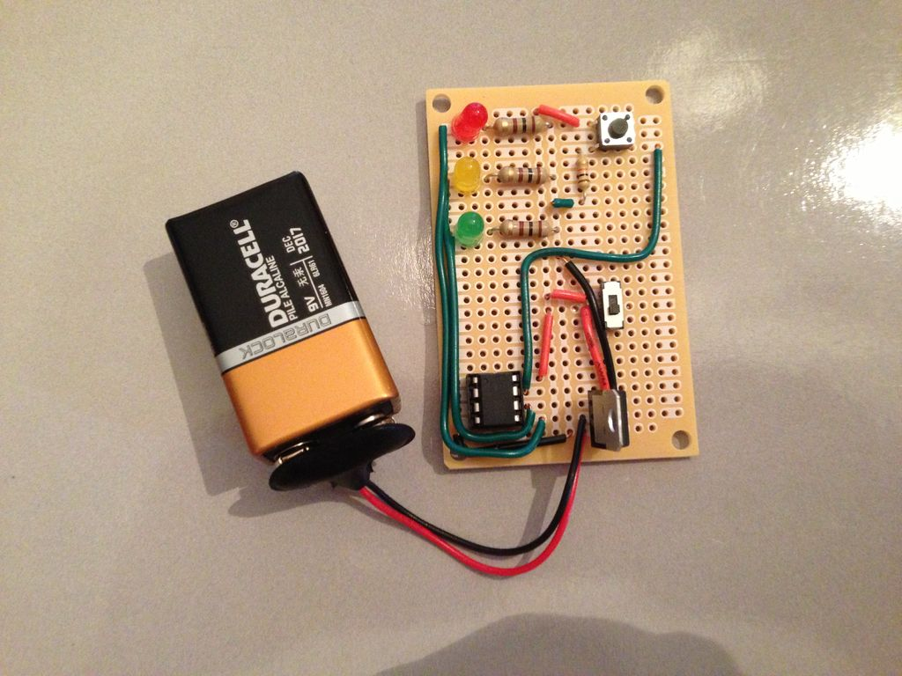
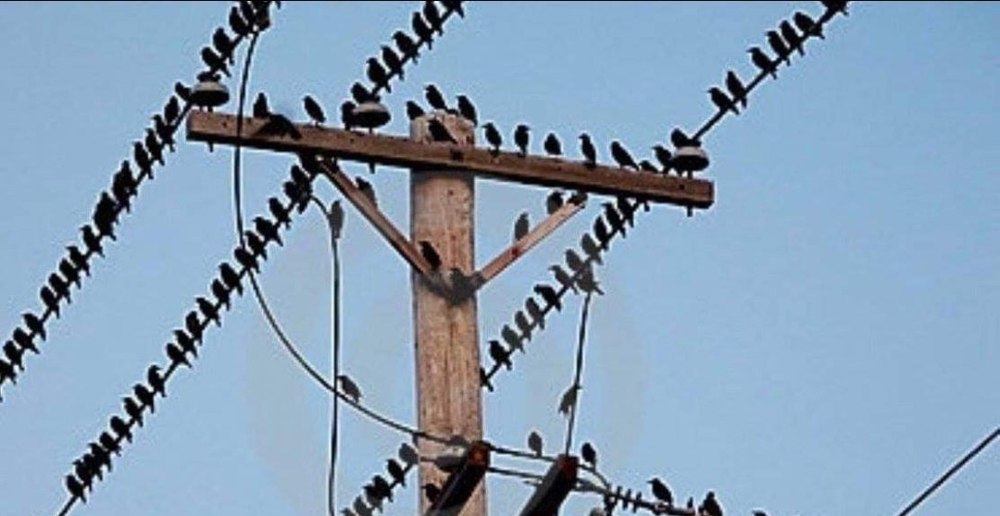
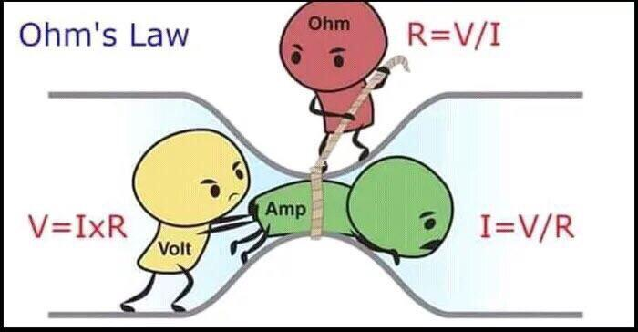

# Tutorial 0 - Basic Knowledge

#### 0. Objective of Hardware

+ Design and make prototype of electronics circuit
    - To choose electronics component
    - To debug a failing circuit

#### 1. The (How to) Basics

##### 1.0 Basic electronics

There's few type of electronics component.
<table border="0">
<tr>
    <td align="center">Resistors</td>
    <td align="center"></td>
</tr>
<tr>
    <td>Capacitor</td>
    <td></td>
</tr>
<tr>
    <td>Inductor</td>
    <td></td>
</tr>
</table>

##### 1.1 Voltage

The first things we are going to talk about will be Voltage. 

When talk about voltage, assuming you have no electronic or electrical background, the first thing you may think, might be a high voltage warning. However, such warning might make people misinterpret how voltage works.

In Physics, voltage is also called electric potential "difference". Which also suggested that it's some kind of subtraction. Look at the picture. 

Don't worry, no birds were harmed. Anyway, this is a very good demonstration of the importance of a reference. The power line those birds stood on probably operating over thousands of volt. However, birds won't be killed as there's no voltage difference on where they are standing.

However, if you are being electrical shocked unluckily. During the process, you are actually creating a reference by putting your feet onto the ground as the ground you stand on and the ground of the power plug are generally connected. As a result, 220V induced across your body and current will flow.

Let's use gravity as another example. A ball on a table will fall to the ground if you push out of the edge. However, if you don't push it to the edge, assuming the table is flat, it will remain on the table, as at the point of view of the ball, the table is its "GROUND". Or say it in another way, the best way to prevent something from falling, is to put it on the ground. Nothing will fall if it's on the ground at the first place. Even if it's happening on 28th floor.

Therefore, for voltage exist, you need to create a reference. A.K.A. a closed circuit (which means make the circuit form a loop).

##### 1.2 Ohm's Law

Ohm's Law is a simple yet very important law in electrical and electronic engineering.
$$
V = IR
$$
While V stands for Voltage, I stands for current and R stands for resistance.

And this picture explain it perfectly.

